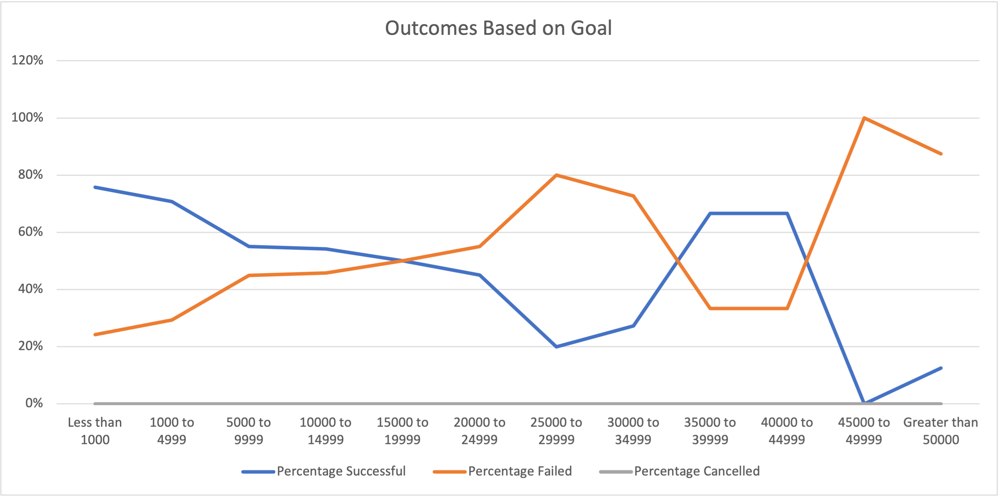
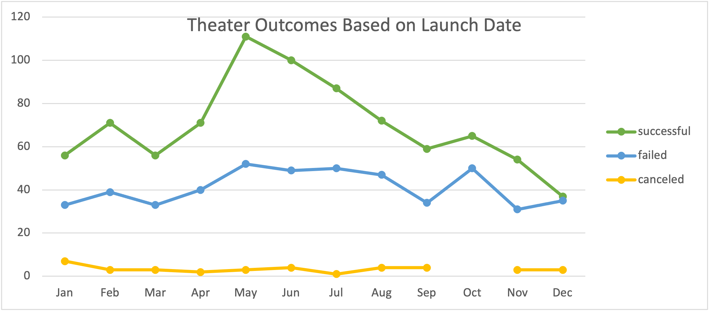

# kickstarter-analysis
# Overview of Project
We have been tasked with analyzing various fundraiding data, specifically how different theater campaigns fared in relation to their launch date and funding goals. We will look at theater campaigns over a period of time, as well as looking at each play to see if the campaign met its goal. 

# Analysis and Challenges
The outcomes vs launch data, shows that the number of successful and failed campaigns vary each month. The data shows that cancelled campaigns occur at a fairly regular rate across any launch date. As demonstrated below, there were more successful campaigns that launched by May of each year. 
.

Some difficulties in analyzing this data is the shear number of data points, and so there must be concise filtering to ensure that the results are not only correct but in a presentation format that is understandable and easy to follow. 

The outcomes based on goals data shows that lower goals are around 80% successful meanwhile, campaigns with goals much larger do not fair as well. .

# Results
Taking a look at outcomes in relation to launch dates, the following can be determined:
  - The time of year greatly impacts funding goals and whether a campaign is successful. 
  - The drawbacks of this dataset is that we cannot see how long it took for each of those campaigns to reach its goal. 
For the outcomes based on goal, the following can be determined:
  - The lower the goal the more likley the campaign will be successful. 

# Summary 
With the outcomes based on goal data, there were no cancelled play campaigns therefore, this data may not be indicitive of all theater campaigns. Further, with this give data we cannot tell how long it took to raise the funds. The data does exist however not part of the results presented. Some additional data to include would be the length of campaign vs success, this would allow us to see if the campaigns wer prematurely cut short of its funding goal or is funding was just lackluster for the project. 
